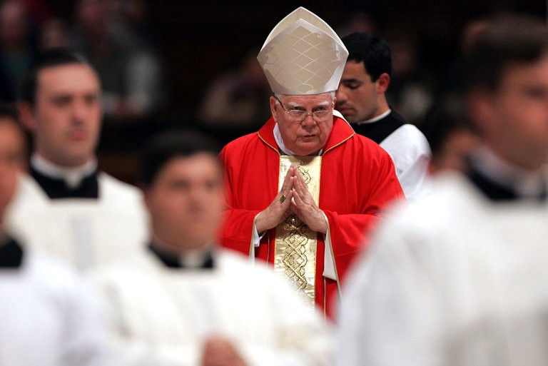

On the evening of the 23rd of March a young woman from Cyprus was found unconscious in her home and was later pronounced dead after having been transferred to the hospital. Elena Frantzi was only 29 when she allegedly took her own life after having endured a lifetime of rape and abuse in the hands of her foster parents.
The news of the woman’s death made the headlines for a couple of days after her death, but that was it. Like every case that rightly deserves our attention and outrage, as well as the attention of each respective government agency and news outlet, it was forgotten in mere days. Elena was not famous; not a celebrity, not an actor, not a pop star, so her 11 minutes of fame were quickly done away with. It appears that such news have become some sort of a triviality that our societies are growing increasingly numb to. Although Elena’s name is bound to fade from the public’s memory before long, the time is long overdue for the public to speak up and condemn the atrocious behaviour of the sick individuals who forced her actions and were complicit in her abuse.

At the age of four, and because of her mother being a drug addict, Elena was given to her foster family by the government. Her foster father, Stylianos Savas was a priest. Like many helpless children who have happened over the years to have the privilege of priestly care, she was repeatedly raped all the way through her childhood. When she tried to speak up at the age of ten — and I can only imagine the courage and resolve it takes to do so — no one believed her. Ax expected, the mental and physical rape, torture and abuse held on. Some years later, another attempt was made and, being an adult now, her allegations were taken seriously. Her godly caretaker was convicted in 2013 and, enjoying the justice that the pious so suspiciously often do, served a mere two years in prison only to be released in 2015.

### INSTITUTIONAL RAPE

It takes a very credulous and deluded individual to believe that this is justice served. Most times the occupation of criminals is of no particular interest to the case, but I often struggle to disassociate the Church from such heinous crimes. For an institution that reportedly promotes love for thy neighbour and enemy alike, it appears to be constantly involved in scandals of the sort. It is also worth pointing out that said priest was not even excommunicated from his own church. Since this is the case, then, it logically follows that the Church condones such behaviour and, dare I say, promotes it, given that the criminal priest was later appointed to a women’s monastery and given a new home next to a primary school (coincidence is a word that should be used with suspicion here).

Readers that have been following the Church's dealings might have already drawn a parallel to the case of cardinal Bernard Francis Law. Law, the former archbishop emeritus of Boston, was involved in a much publicized scandal back in 2001 when he was accused of taking part in the cover up of several cases of child molestation in his church. Although there were no allegations of him directly partaking in these vile crimes, could anyone in their right mind ever possibly excuse him for turning a blind eye? After a series of high-profile allegations and the exquisite work done by the Spotlight team of the Boston Globe, Law finally resigned from the Archdiocese of Boston on December 13, 2002. As per usual, these events failed to signal the end of Law’s reign as a high-profile member of the Hole See. Far from it. Hardly a year later, he was appointed archpriest of the Basilica di Santa Maria Maggiore in Rome.

### CONTRADICTIONS

In a statement made by the superior of Elena Frantzi’s step father — whose face and name the major media outlets were conspicuously reluctant to release — it was mentioned that the laws of the land do not directly apply to the holy institution of the Orthodox Church, which had reportedly exhausted their disciplinary measures against him. Such was also the case in 2001, when it was revealed that the law did not yet apply to complicit and enabling parties in crimes within religious institutions.

The Church operates within the confines of our societies and secular law. Thus, it would (again) logically follow that it should comply to the legal standards of each respective state. The fact that religious groups have been left to their own devices and systematically allowed to get away with murder (both literally and metaphorically) reveals both a deep well of public credulity and a stupendous resistance to progressive values and ideals. Some may say that the Church is a much-needed outlet, since religion has imbued us with our sense of morality. Well, in that case, can you possibly fathom sacrificing your child to your God? Will you really kill your neighbour for working on a Sunday? Are you willing to live under an ever-watching, omniscient and omnipresent deity, monitoring your every move and thought and judging you for them not only while you live, but even after you are long gone? Can you bear the thought of your dead child eternally stuck in limbo? (the idea of limbo was never part of the Bible but we can always rely on the Church to introduce such sadistic ideas.) Do these teachings, dear reader, align with your moral code? You often hear the pious say “We only believe in the good bits of the Bible”. Well, then, if you have the rational capacity to distinguish what is right and wrong by the standards that our secular societies have set, as well as your innate morality, why do you need a 2000 year old cult to tell you what is moral and what not? In addition, if even the vicars of Christ on Earth can’t keep their willies in their pants — and take them out on little children, for heaven’s sake — can you seriously say that this is the institution that represents your belief in the divine and dictates your moral code?

The case is also made that religion is needed for the good it does in the form of charity, consolation and public services, to name just a few. It seems to me, though, that for the good the Church does it makes up for with absurd amounts of wrongdoing; the alliance of the Catholic Church with the Third Reich, the genocide of Muslims by the Catholic Right in the Balkans during the 90’s, the backing of the Catholic Church of the ethnic cleansing in Rwanda and the perpetual struggle between Shia and Sunni in the Middle East are only the examples that I struggle not at all to recall. And these are just recent events, a fraction of the atrocities committed by people who deluded themselves thinking they have the correct God on their side. If you absolutely have to take credit for the miniscule good the religious have done over the centuries you also have to answer for the bad. It appears to me that it takes half a decent person to help their fellow creature and live by the Golden Rule without the backing of religion in this matter.

It is about time we grew out of this childishness.

### PERPETUAL RELUCTANCE

The continuous reluctance of the Church — and by that I mean both predominant divisions — to condemn acts of violence and terrorism against the young should be a constant reminder to all of the rotten core of our societal structure. This biggest and most obviously criminal organisation keeps expanding in plain sight, while in a painfully obvious manner keeps reassuring us of its dominant status. The Church was, is and probably will keep being exempt from any form of punishment or regulation, even when the crimes their members commit are condemned by the states they operate in. The fear of governments to stand up to the pious lest they cause uproar, be branded as unbelievers (and, god forbid, atheists) or lose a significant portion of their political base, even when their agenda is obviously indifferent to religion, is significantly slowing down our progress by preserving a monolithic dogma that came to be back when humans didn’t even know where diseases came from.

Elena Frantzi’s tragedy is only one case in the hundreds that we can credit Christianity with. It is time we stood up to the atrocities of the Church and conceded that if child rape is sick when committed by a psychologically unstable person, it is profoundly more so when carried out by those who claim to be the spiritually and morally superior.

May her memory live on.