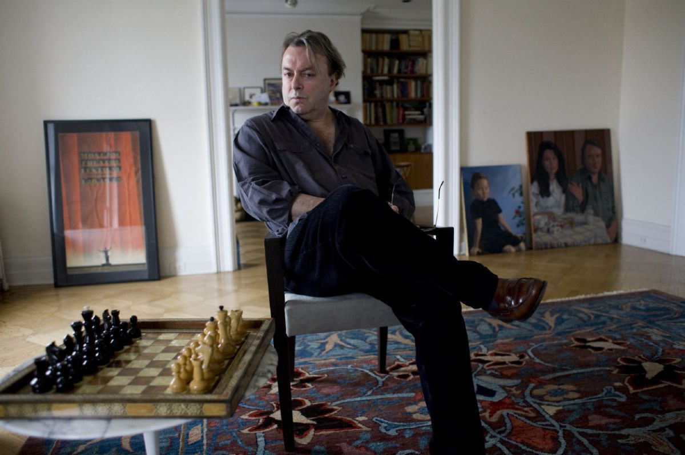

A sentence that doesn't stir up any particularly arousing emotion, to be sure, but contemplated in the right context it holds enormous power and strength. It was uttered by Christopher Hitchens back in 2010, a year before his unfortunate demise, [while debating Tony Blair](https://www.youtube.com/watch?v=ZSJ5CrZ_3Pg) on the positive impact of religion upon the world. The full content of the excerpt is well worth noting here:

> "In other words, that the discussion about what is good, what is beautiful, what is noble, what is pure, and what is true could always go on. Why is that important? Why would I like to do that? Because that’s the only conversation worth having. And whether it goes on or not after I die, I don’t know. But, I do know that it is the conversation I want to have while I am still alive. Which means that to me the offer of certainty, the offer of complete security, the offer of an impermeable faith that can’t give way is an offer of something not worth having. I want to live my life taking the risk all the time that I don’t know anything like enough yet… that I haven’t understood enough… that I can’t know enough… that I am always hungrily operating on the margins of a potentially great harvest of future knowledge and wisdom. I wouldn’t have it any other way."

If you are unfamiliar with Hitchens' work, dear reader, I would urge you to look into his decades-worth of books, articles and talks that are now easily accessible to you. He has tremendously shifted my life towards a better direction and I am confident when saying that, if you are in the lookout for someone to reinforce the accuracy of your moral compass, he can be the one to assume that role for you.

Tradition is a powerful force, and like every year, families and friends around the world gather up during festive times, as these are, to celebrate the supposed birth of Jesus of Nazareth. Ironic as the following is, the topic of religion is so deeply rooted in the public's psyche, so intrinsic an element of our culture, that even the mere mention of mild scepticism against its notions is frowned upon in such gatherings. (If you know me at all, dear reader, you would know that my offensive against faith and the pious is everything but mild). If you, too, are troubled by questions of morality and reason, the proper way to live a good life, our purpose on this speck of dust and more of such philosophical nature, you too would have the urge, I assume, to voice these concerns and look for outlets of expression whenever these are available. To family, we are not related by choice, and as such, each of our families' convictions can vary dramatically from yours and mine. It, thus, becomes inevitable that the occasional clash will occur, whether that takes five minutes to surface or five years. You would also have already noticed that yearly gatherings of the sort tend to get suspiciously repetitive really fast. People complacent with their life hardly find the time and energy to tread outside their comfort zone, and, thus discussions, revolve around the same bland and boring topics that you and I have come to despise so much.

In this, dear reader, I am sure you will be no exception this year round either. I am sure you sat through a family lunch or dinner, feasting on the proverbial turkey, cow or chicken. Gatherings like these can be pleasant. Having lived away from my country of origin for the past couple of years, I am not at all hesitant to say that I am looking forward to the warm feeling of belonging that family elicits around the dinner table regardless of occasion. Politics is often brought up, and the economy also - we live in turbulent times, anyway. But these are hardly of any philosophical nature. I will debate anyone on geopolitical issues and the economy, since these are matters that interest me greatly, but even more so, I will pursue a debate with people indifferent to either, as I don't find stances like these to be serious at any degree. When it comes to religion, though, the alpha and omega of discussions and the one that should be in the forefront of our discourse, it hardly finds any eager takers. I believe multiple factors play into this paradox.

By many, faith is considered to be the thick pillar that holds culture together, with religion its vessel of delivery to the pious. Culture, also, provides a single identity to the people of the nation; it encircles their values and justifies their history. Humans are social creatures and have a need to belong. The herd mentality rightly applies to us. It is a matter of biology and survival, as much as one of comfort and security. Religion intertwined with culture, thus, are the pillars of what holds society together. This is a rather short summary of how I view the notion of our cultural origins, but I would also argue that a secular society *is,* indeed, the goal, if only a rather utopian one at this stage of our mental development and behaviour towards the great existential questions that have troubled us since we gained mastery of our cognitive faculties. 

If this is the case, then, it follows that the question of religion and its usefulness should be the first and most important frontier of our discourse. What is more important, I dare you ask, than an inquiry on our origins, our purpose on this planet and the discussion of what makes us moral, just and guides us towards a constantly improving world for us and all the creatures of our cosmos?

You can see now, dear reader, the weight under which our initial sentence guides our discussion.

At this important junction, I would be remiss if I didn't stress the point that, given the importance that religion is given by the public, and the esteem the former holds the latter's guiding principles to, people's arguments in favour of it seem to be outrageously scanty and thin. Vague utterances, ignorance to the contents of the holy texts, and shamelessly conspicuous *non sequiturs* define the body of the opposition's position on the matter. It troubles me not at all, then, to assert that a conversation on such a high matter is of both inquisitive, as much as informational importance to the opposing party. 

So why is it, that a discussion so important to our species appears so difficult to initiate and even more so to sustain? The reason is twofold.

The first - and arguably the most important one - is the value that faith has for the host. If you haven't already noticed, people don't like their beliefs questioned. They are defined by them, as you and I are, and they are the pillars that hold the edifice of their being together. Our beliefs define our morals, our behaviour towards our fellow creatures and the way we see and understand the world. Whether conscious of them or not, they are so intrinsic to us all - regardless of nature - that their examination, evaluation and, more rarely so, eventual dismissal is an arduous process and presents us with a difficult challenge. Our beliefs change over time. It is a violent process that never ceases. As long as there is information that we are oblivious to, the healthy and inquisitive mind should never be allowed any rest.

Matters become much simpler and straightforward when it comes to everyday life. Professionals  reach mastery in their field through study and constant learning. New information always reveals itself to the pupil and forces one to correct mistakes, improve upon their method of conduct and come one step closer to expert status. Although the same process should always be underway with one's beliefs, this is rarely the case among the resigned from inquisition. People shift their political beliefs when their side fails to satisfy their expectations, move away from the use of materials damaging to the environment and change their diet when it doesn't align with their ideals. You will rarely witness the same transformation when it comes to the numinous and the divine, though. The case also strengthens when people of older generations are concerned. They say you cannot teach an old dog new tricks, and this is partly true. An appeal to the cynic, also, reveals that faith is a staple of past generations that will soon pass away and be replaced by people of secular values. Although all this is justifiably so, idleness in the face of fallacy and mass delusion is hardly an option I see appropriate retreating to here. I claim that the conversation with everyone concerned has to go on, since everyone *is*, indeed, concerned.

The second factor has to do with the actual occasions I mention earlier. Consider for a moment how many people swim through time with no change in their routine, no deviations from their day-to-day life, not a single event that would trigger the slightest discomforting process or thought-provoking inner discussion. As long as people are content they are complacent and as long as they are complacent they have the least bit of interest in a paradigm shift. (I will unashamedly and proudly exclude myself from that bunch; I hope you will have the courage to do so yourself). Now, take the above as granted, and think of the degree of interest and importance a once-a-year discussion about the most important questions of the cosmos could - or rather, should - have to all of us. Once a year, you (I am not targeting you specifically here) get to sit around a table with people holding beliefs across an extremely wide spectrum - the proverbial ultra-nationalistic uncle is conspicuously at play here. Wouldn't this in itself be reason enough to initiate one such gathering? Isn't the refining of your ideas through argumentation and reexamination a noble enough cause to stir up a discussion? I will allow you, if only reluctantly so and only because I have no power over you, the comfort of complacency, but you should also allow yourself the privilege of discomfort at least once a year. Comfort doesn't breed change and change is the only thing that has moved us forward to where we are now. Even your own Church, whichever that may be has had to go through a lengthy process of change in order to adapt and correct past mistakes. Even they, the most dogmatic among us, have finally had to ask for forgiveness for past crimes and their complicit behaviour when the worst among us rose to power.

I will consciously refrain from delving into the arguments for or against religion as this is not the case I am trying to make here. All I am trying to get through is the paradox between people's deeply rooted belief in the divine and everything it encompasses, and their reluctance to engage in a deeper discussion when it comes to religion's merits; regarding this, I believe I have made my point clear.

I will close, dear reader, by asking you to allow me a suggestion. Whenever you are engaged in this most important of conversations, try to keep an open mind to the oppositions' arguments and positions. I know you hold yours to high esteem also, and so you should allow others the same benefit. I would also request of you to avoid such bitter dogmatisms that dominate the faithful; our positions are strong, but their strength is derived from long periods of contemplation and scrupulous testing. We require evidence to support our claims and we settle for nothing less. Facts are the weapon of the informed. Whenever the opposing party presents theirs, be inquisitive and be thorough. Be cautious, also, when fantasies and long-lost stories of legend are presented as facts and justified through ancient scribblings that are mere word of mouth put on paper. We do not need a single book or *any* single book to guide our way. We require many books, many sources of knowledge that even contradict and improve upon each other to form our opinions and morals. We need not a single authority to supervise us, no rigid moral code to justify our behaviour. Be adaptable and be accepting of change. Times will change and so will the core foundations of your existence. The only thing you should pay attention to is the improving effect these changes have on you and on others. If this appears not to be the case, revise your moral code and examine why this has shifted towards the direction it has. Be scrupulous and be just. When evidence to support your claims is absent, swiftly move away from them. Your goal should never be to become the aggressor, as this will strengthen the opposition's dogmatisms. Never allow yourself to be censored and never allow yourself to be the censor. You should strive to deeply understand the opposition's views and the reasons they hold them. This is, and always has been, the key to the Socratic method. When the opposition is amiss, offer to guide them back to reason, to justice, to secular morality as it has evolved to serve us. Be bold and be just. And always remember this; knowledge of ignorance always outmatches ignorance of knowledge.