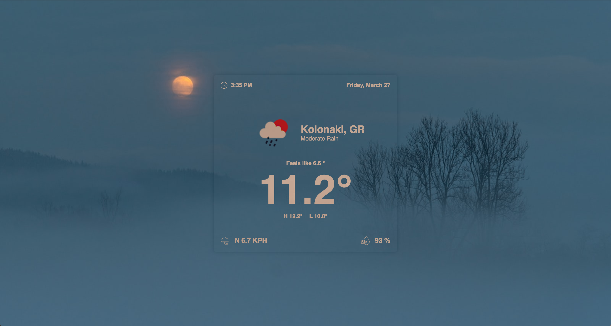
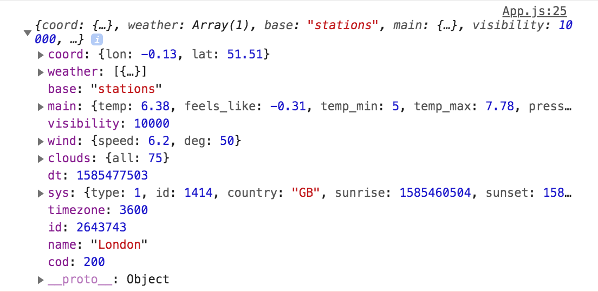
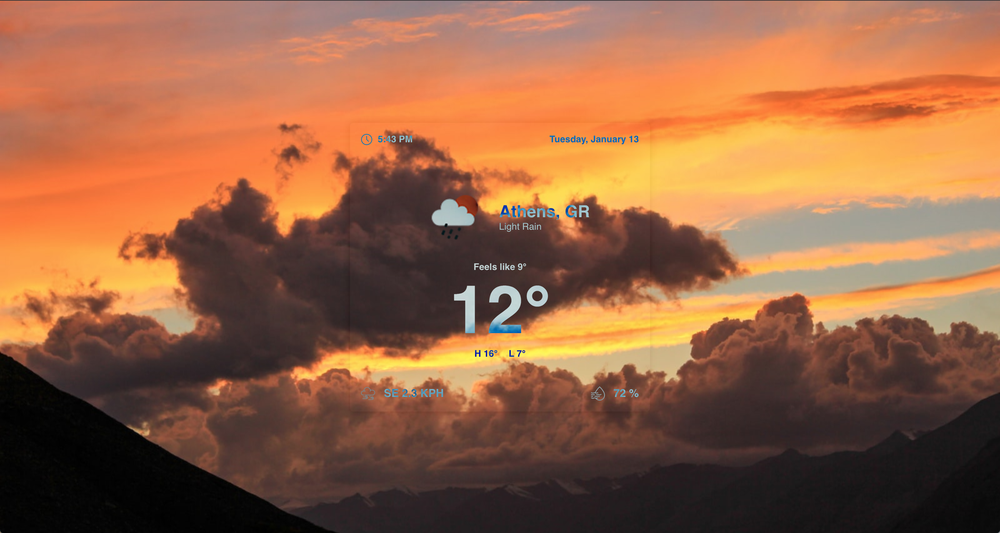

## Table of Contents
  1. [Concept](#concept)
  2. [Project Setup](#setup)
  3. [Initialisation & Basic Styling](#init)
  4. [Getting Our API Key And Adding It To Our Project](#api)
  5. [Fetching Our Data](#fetching)
  6. [Getting The User's Position](#position)
  7. [Adding Placeholder Data And Styling Our Container](#placeholder)
  8. [Passing Data To Our Components: The Problem](#problem)
  9. [Passing Data To Our Components: The Solution Pt.1](#solution-01)
  10. [Passing Data To Our Components: The Solution Pt.2](#solution-02)
  11. [Bonus Step: Storing User Preferences In The Browser's Storage](#bonus)

## Concept <a name='concept'></a>

In this post we are going to make a realtime weather application in React using the Fetch API and geolocation as accessed through the [Navigator](https://developer.mozilla.org/en-US/docs/Web/API/Navigator) interface. Once we get our data in our app we will be able to see information like temperature, location, humidity, wind speed and direction. These we will draw from one of the many free weather data sources called [Open Weather](https://openweathermap.org/), but any other will do just fine so feel free to use the one that suits your taste best.

The Github repo can be found [here](https://github.com/evan-kapantais/weather-app).

This is what the app will look like upon completion. I'm a developer, not a designer - don't judge.



Let's dive right in.

## Project Setup <a name='setup'></a>

To kick things off, we will create a new React project using the following command in our Terminal / Bash.

```
npx create-react-app weather-app
```

This will create a new React app called `weather-app` in our current directory using the [create-react-app](https://reactjs.org/docs/create-a-new-react-app.html) boilerplate package.

> The reason we are using npx versus npm is that npx temporarily installs **and** executes packages instead of simply installing them like npm does. Npx executes packages, npm manages them. More info on npx [here](https://medium.com/@maybekatz/introducing-npx-an-npm-package-runner-55f7d4bd282b).

I usually go with [Styled Components](https://styled-components.com/) when tackling bigger projects, but for the purposes of this one I will just be using [Sass](https://sass-lang.com/install). To set up our project we will do the following.

- Install Sass using our computer's terminal or our editor's integrated one (I am using [VS Code](https://code.visualstudio.com/)).

```
npm i --save node-sass
```

- Delete all the files we won't need.
- Clear out `index.css` and `App.css` and rename them and their imports to `.scss`.

## Initialisation And Basic Styling <a name='init'></a>

The first thing we need to do is turn our default functional component in `App.js` into a class. We are doing this so we can utilise the lifecycle methods of the class system and be able to store weather data and the status of the API call later on. On the App component itself we are only going to return an empty `div` with the class of `container` that we will later populate with the appropriate data. In out class's state object we will have three key-value pairs: the status of the call, an object with the weather data and a boolean checking whether the data is loaded.

This is what we have for the moment.

```javascript
// App.js
import React from 'react';
import './App.scss';

class App extends React.Component {
  constructor(props) {
    super(props);
    this.state = {
      status: 'init',
      isLoaded: false,
      weatherData: null
    }
  }

  render() {
    return (
      <div className='App'>
        <div className='container'>
          
        </div>
      </div>
    );
  }
}

export default App;
```

Nothing fancy so far. We only have a fixed-width-and-height container with basic styling. Below is our initial setup for App.scss and index.scss. I am using the former to style specific elements of the app and the latter for global styles.

```scss
// App.scss
.App {
  height: 100vh;
  background: url('https://source.unsplash.com/collection/1408037/1600x900') no-repeat center / cover;
  color: #fff;
  display: flex;
  justify-content: center;
  align-items: center;
}

// Main Container
.container {
  position: relative;
  display: flex;
  flex-direction: column;
  justify-content: space-between;
  width: 400px;
  min-height: 364px;
  padding: 1rem;
  border-radius: 5px;
  box-shadow: 0 0px 10px #111;
  mix-blend-mode: difference;
  user-select: none;
}
```

```scss
// index.scss
* {
  margin: 0;
  padding: 0;
}

body {
  margin: 0;
  font-family: 'Helvetica', sans-serif;
  -webkit-font-smoothing: antialiased;
  -moz-osx-font-smoothing: grayscale;
}
```

## Getting Our API Key And Adding It To Our Project <a name='api'></a>

We first need to visit openweathermap.org and sign up. Shortly after, we will get an email with our API key. Alternatively we can navigate to our user area and find it under the API Keys menu. Our key is universal across their service and we can use it to reach any of the endpoints they offer.

Now that we have our key, there is a special way we need to handle it in our project. In general, sensitive information about API calls needs to be stored in special files that can then be accessed through Javascript so they don't get exposed to the browser. This way we protect our keys from being visible to anyone visiting our webpage's developer tools and viewing our source files.

The way we will store our API key in the project is by creating a new `.env` file. A name for the file is not required (just like `.gitignore` files), as these are a bit different in functionality. Files with the `.env` extension are generally hidden from browsers and that's why they are perfect for storing sensitive data. What is also special about them, is that there is a certain way we can access them from our application, which we'll see later on. In these types of files we usually follow the specific syntax `KEY_NAME=VALUE` for naming things. We use all uppercase letters with underscores, while there are no spaces around `=`.

Since we used `create-react-app` to create our project, we are forced by it to prefix our key name with `REACT_APP_`, otherwise it will not work. Now we will create an `.env` file in the root of our project with our key stored like this. 

```
REACT_APP_WEATHER_KEY=983h6791jda03fh29glka4765e94h8d5
```

(This key is a placeholder - it won't work. Be sure to replace it with the key you get from Open Weather.)

> Since we need to protect our key we need to also add our `.env` file to our `.gitignore` list so that it is not added to version control. If we don't - and our repository is public - anyone can view the key. 

```
// .gitignore
# dependencies
/node_modules
/.pnp
.pnp.js

# testing
/coverage

# production
/build

# misc
.env
.DS_Store
.env.local
.env.development.local
.env.test.local
.env.production.local

npm-debug.log*
yarn-debug.log*
yarn-error.log*
```

## Fetching Our Data <a name='fetching'></a>

With our key added to the project, we now need a way to get our weather data. For that, we will create a function called `getWeatherData` and use our key to reach Open Weather's endpoint. 

> For the purposes of this post we are only going to be dealing with information regarding the current weather, although the API offers services like forecast, historical data and so on. Examples on how to use the API are well documented on Open Weather's website.

Instead of looking for the weather conditions of a fixed location on the map, we are dynamically going to get the weather of the location of the device accessing our website. More specifically, we will use the latitude and longitude of the device, as accessed by the Navigator interface.

To start off, let's set up our function to look like this, and then we'll go through what is going on in detail.

```javascript
getWeatherData = () => {
  const weatherApi = `http://api.openweathermap.org/data/2.5/weather?q=London&units=metric&appid=${process.env.REACT_APP_WEATHER_KEY}`;

  fetch(weatherApi, { signal: this.controllerSignal })
  .then(response => response.json())
  .then(
    (result) => {

      console.log(result);

      const { name } = result;
      const { country } = result.sys;
      const { temp, temp_min, temp_max, feels_like, humidity } = result.main;
      const { description, icon } = result.weather[0];
      const { speed, deg } = result.wind;

      this.setState({
        isLoaded: true,
        weatherData: {
          name,
          country,
          description,
          icon,
          temp: temp.toFixed(1),
          feels_like: feels_like.toFixed(1),
          temp_min: temp_min.toFixed(1),
          temp_max: temp_max.toFixed(1),
          speed,
          deg,
          humidity
        }
      });
    },
    (error) => {
      this.setState({
        isLoaded: true,
        error
      });
    }
  );
}
```

To test out the API we will used a fixed location first and when we proceed further we will substitute this with the actual location of the user.

We can see on the second line how the API key is actually going to be used to get the weather of London, UK. Some things to notice here about the syntax:

1. We use `q=London`  to specify the location we are after.
2. Every parameter of the call needs to be separated by an ampersand (`&`).
3. We are using `units=metric` to convert from imperial units.
4. In order to use our environment variable, we need this specific syntax: `process.env.VARIABLE_NAME`. This way our program will look for our variable in the `.env` file at the root of our project.
5. We are using the ES6 [string interpolation](https://developer.mozilla.org/en-US/docs/Web/JavaScript/Reference/Template_literals) feature to add our value to the string. In order to do this we need to use a string literal and inject our variable in it using the syntax `${VARIABLE_NAME}`.

We are passing here our key to `fetch` as an argument. Notice how we are also passing an object as an (optional) second argument. This specific key-value pair is derived from Javascript's [AbortController](https://developer.mozilla.org/en-US/docs/Web/API/AbortController) interface that is used to cancel out any requests. We will need to configure this in our class, and call its `abort` method to cancel any calls when our component is about to unmount.

Right under our constructor, we will need to add these two lines.

```
abortController = new AbortController();
controllerSignal = this.abortController.signal;
```

Then, in the `componentWillUnmount` function we will need to call `abort()` as mentioned above.

```javascript
componentWillUnmount() {
  this.abortController.abort();
}
```
---
1. The fetch API always returns a [Response](https://developer.mozilla.org/en-US/docs/Web/API/Response) object that we can use to extract the weather data we're after. To do so, we need to chain a `then` method, passing in that response object and turning it into [JSON](https://www.w3schools.com/whatis/whatis_json.asp) so we only have to deal with the object containing the actual data.
2. On the second and final `then` method, we pass in the result of the first one (which now contains our data).
3.  Now we need to store that data somewhere so we can access it throughout our application. The easiest way to do so is to store it into our class's `state` object. The first step we are taking, although not a necessary one, is to [destructure](https://codetower.github.io/es6-features/#Destructuring) our data into variables so our function look a bit cleaner.
4. We are setting the state's `isLoaded` value to `true` and then populating the `weatherData` object with the information we need from the API's returned object.
5. For values 5 - 8, we are rounding the default two decimal points to one, as it doesn't make much sense to be that specific when it comes to temperature degrees.
6. To handle any possible errors, we are chaining an additional function that takes the thrown error as an argument and adds it to our class's state.
> Notice here how, instead of writing `name: name`, we can just add the variable name and that creates a key string with the same name. Thus `name` becomes `name: name_value`, temp becomes `temp: temp_value` and so on.
---

That's everything we need to do to get our data with the fetch API. Before moving on, it would be nice to see that we are actually getting back the data we are requesting successfully. For that reason, we are logging to the console our JSON-formatted result, and calling `getWeatherData()` when our component mounts to the DOM like so.

```javascript
componentDidMount() {
  this.getWeatherData();
}
```

If we now open our browser's developer tools and navigate to the Console tab, we can see our returned object.



Ta-dah! All the data we need is right there. Now on to the fun stuff.

## Getting The User's Position <a name='position'></a>

We are going to utilise the Navigator interface we mentioned earlier to get the position of the user. We are additionally going to make a couple of checks to confirm that geolocation tracking is  available and whether it is allowed by the user.

Under our Abort Controller definition, we are going to create a new function called `weatherInit` to initialise this behaviour.

```javascript
weatherInit = () => {

  const success = (position) => {
    this.getWeatherData(position.coords.latitude, position.coords.longitude);
  }
  
  const error = () => {
    alert('Unable to retrieve location.');
  }
  
  if (navigator.geolocation) {
    navigator.geolocation.getCurrentPosition(success, error);
  } else {
    alert('Your browser does not support location tracking, or permission is denied.');
  }
}
```

A few things are happening here. When our program runs this function, control passes directly to the `if / else` statement at the bottom. This checks if Geolocation is actually available in the browser. If it isn't control passes immediately to the `else` statement and an alert with a message is displayed. If it is, we call the `getCurrentPosition` method of the interface and passing in as arguments two callback functions for `success` and `error`, functions which we have defined above. This is what will happen next:

1. The user gets prompted by the browser to allow his location to be tracked.
2. If they don't, control passes to the `error` function and an alert is displayed. The user will have to clear the page settings for the page and reload it for permissions to reset.
3. If they do, and location tracking is successful, control is passed to the `success` function which takes the returned position from `getCurrentPosition` as an argument.
4. We then get the latitude and longitude from the position argument through `position.coords.latitude` and `position.coords.longitude` and pass these as arguments to our previously created `getWeatherData` function.

At this point we need to modify our `getWeatherData` function to use coordinates instead of a fixed location. This is how our function looks after modifying it to use the correct data.

```javascript
getWeatherData = (lat, lon) => {
  const weatherApi = `http://api.openweathermap.org/data/2.5/weather?lat=${lat}&lon=${lon}&units=metric&appid=${process.env.REACT_APP_WEATHER_KEY}`;
  [...]
}
```

We also need to modify `componentDidMount` to call `weatherInit` instead of `getWeatherData`, otherwise the latter will have no latitude or longitude to work with and we will get an error.

```javascript
componentDidMount() {
  this.weatherInit();
}
```

Our App class now looks like this.

```javascript
class App extends React.Component {
  constructor(props) {
    super(props);
    this.state = {
      status: 'init',
      isLoaded: false,
      weatherData: null
    }
  }

  abortController = new AbortController();
  controllerSignal = this.abortController.signal;

  weatherInit = () => {

    const success = (position) => {
      this.getWeatherData(position.coords.latitude, position.coords.longitude);
    }
    
    const error = () => {
      alert('Unable to retrieve location.');
    }
    
    if (navigator.geolocation) {
      navigator.geolocation.getCurrentPosition(success, error);
    } else {
      alert('Your browser does not support location tracking, or permission is denied.');
    }
  }

  getWeatherData = (lat, lon) => {
    const weatherApi = `http://api.openweathermap.org/data/2.5/weather?lat=${lat}&lon=${lon}&units=metric&appid=${process.env.REACT_APP_WEATHER_KEY}`;

    fetch(weatherApi, { signal: this.controllerSignal })
    .then(response => response.json())
    .then(
      (result) => {
        console.log(result);
        const { name } = result;
        const { country } = result.sys;
        const { temp, temp_min, temp_max, feels_like, humidity } = result.main;
        const { description, icon } = result.weather[0];
        const { speed, deg } = result.wind;

        this.setState({
          isLoaded: true,
          weatherData: {
            name,
            country,
            description,
            icon,
            temp: temp.toFixed(1),
            feels_like: feels_like.toFixed(1),
            temp_min: temp_min.toFixed(1),
            temp_max: temp_max.toFixed(1),
            speed,
            deg,
            humidity
          }
        });
      },
      (error) => {
        this.setState({
          isLoaded: true,
          error
        });
      }
    );
  }

  componentDidMount() {
    this.weatherInit();
  }

  componentWillUnmount() {
    this.abortController.abort();
  }

  render() {
    return (
      <div className='App'>
        <div className='container'>
          
        </div>
      </div>
    );
  }
}
```

With the bulk of our App's logic done, what we need to do now is find a way to display our data in our `container`.

## Adding Placeholder Data And Styling Our Container <a name='placeholder'></a>

Up to this point, all we are returning in our class is an empty `div` with the class of `container`. To begin setting up our view, let's create a new folder called `components` and in it create a `WeatherData.js` file where we will configure the structure of the displayed data. In our `src` folder, we will also create an `images` folder and add into it [these icons](https://drive.google.com/open?id=15pLG_bs1ER8DLG8CIOlvjst8VuH7DKEJ) icons (downloaded from [Flat Icon](https://www.flaticon.com/)).

Our new file now looks like this.

```javascript
// src/components/WeatherData.js
import React from 'react'

export const WeatherData = () => {
  
  return (
    <>
      <header>
        <div>
          
          <h5>5:43 PM</h5>
        </div>
        <h5>Tuesday, January 13</h5>
      </header>
      <main>
        <div className='weather-main'>
          
          <div>
            <h2>Athens, GR</h2>
            <h3 className='description'>Light Rain</h3>
          </div>
        </div>
        <div className='temp-main'>
          <h5>Feels like 9°</h5>
          <h1 className='temperature'>12°</h1>
          <div className='hi-lo'>
            <h5>H 16°</h5>
            <h5>L 7°</h5>
          </div>
        </div>
      </main>
      <footer>
        <div className='weather-prop'>
          
          <h4>SE 2.3 KPH</h4>
        </div>
        <div className='weather-prop'>
          
          <h4>72 %</h4>
        </div>
      </footer>
    </>
  );
}
```

Some things to note here:

Instead of returning a `div`, or any other known HTML element, we are returning what is called a [React Fragment](https://reactjs.org/docs/fragments.html). A Fragment groups the content we want to return without adding an additional parent node to the DOM. We are doing this because we already have a container that will house our elements and an additional `div` would be superfluous. Below you can see an alternative way of declaring Fragments. The advantages of using the full name, is that now we can add attributes and keys to them. In our case, this won't be needed so we are using the shorthand version instead.

```javascript
<React.Fragment>
[...]
</React.Fragment>
```
In order to use images in React Components, we either need to use the special `require` syntax with object literal injection, or we can otherwise import it at the top of the file like below.

```javascript
// Import at the top of the file
import clockIcon from '../images/clock.png'

[...]

// Use

```

We are here using a hard-coded icon from Open Weather. The string remains the same, but what we are later going to replace is the `10d` part of it.

Below is the styling we will add to our weather data.

```scss
// App.scss
.container {
  position: relative;
  display: flex;
  flex-direction: column;
  justify-content: space-between;
  width: 400px;
  min-height: 364px;
  padding: 1rem;
  border-radius: 5px;
  box-shadow: 0 0px 10px #111;
  mix-blend-mode: difference;
  user-select: none;

  header {
    display: flex;
    justify-content: space-between;
    align-items: center;
    
    div:first-child {
      display: flex;
      justify-content: space-between;
      align-items: center;

      img {
        max-width: 16px;
        margin-right: 0.5rem;
      }
    }
  }

  main {
    text-align: center;
    margin: 2.5rem 0;

    .weather-main {
      display: flex;
      justify-content: center;
      align-items: center;
      text-align: left;

      .weather-icon {
        width: 128px;
      }
  
      .description {
        text-transform: capitalize;
        font-size: 0.85rem;
        font-weight: normal;
      }
    }

    .temp-main {

      .temperature {font-size: 6rem;}
  
      .hi-lo {
        display: flex;
        justify-content: center;
  
        > * {margin: 0 0.5rem;}
      }
    }
  }

  footer {
    display: flex;
    justify-content: space-between;

    .weather-prop {
      display: flex;
      align-items: center;

      img {
        max-width: 20px;
        margin-right: 0.8rem;
      }
    }
  }
}
```

All we need to do now to see our data on our screen is import the file in `App.js` and return it in our `container`.

```javascript
// App.js
import React from 'react';
import './App.scss';

import { WeatherData } from './components/WeatherData'

[...]

render() {
  return (
    <div className='App'>
      <div className='container'>
        <WeatherData />
      </div>
    </div>
  );
}
```

We already have a nice looking container displaying all the essential data we need. Psyche!



> Notice the `background` property in our `App.scss` file. For the URL, we are using a random image from [source.unsplash.com](http://source.unsplash.com). If you don't like the special effect on the lettering and the transparency of the `container`, you can delete its `mix-blend-mode` property and add a solid `background-color` and `color` to it.

One thing we will also do to spice things up a bit is create a `Clock` component in our `components` folder that updates once every second and import it into our `WeatherData` file. I won't go into detail about how it works, since this is beyond the scope of this post, but below you can see our component.

```javascript
// src/components/Clock.js
import React from 'react'

export class Clock extends React.Component {
  constructor(props) {
    super(props);
    this.state = {
      time: new Date().toLocaleTimeString(),
    }
  }

  componentDidMount() {
    this.intervalID = setInterval(() =>
      this.tick(), 
      1000);
  }

  componentWillUnmount() {
    clearInterval(this.intervalID);
  }

  tick() {
    this.setState({
      time: new Date().toLocaleTimeString('en-US', {timeStyle: 'short'}),
    });
  }

  render() {
    return (
      <h5>{this.state.time}</h5>
    );
  }
}
```

Now we can add it to our file.

```javascript
// WeatherData.js
import React from 'react'
import { Clock } from '../components/Clock'

[...]
<header>
  <div>
    
    <Clock />
  </div>
  <h5>Tuesday, January 13</h5>
</header>
```

## Passing Data To Our Component: The Problem <a name='problem'></a>

Since we have already written our code to get the user's coordinates, fetch the data for their location and  populate our class's state with it, we can now safely remove the placeholder data from our `WeatherData.js` file and pass in the data from our class.

What we need to do first is pass the data to our `WeatherData` component.

```javascript
// App.js
render() {
  return (
    <div className='App'>
      <div className='container'>
        <WeatherData data={this.state.weatherData}/>
      </div>
    </div>
  );
}
```

The key name we are passing to the component here is arbitrary; we can give it any name we like.

Afterwards, we can access the data from our child component by adding it as an argument to it and destructuring the data in the component's body.

```javascript
// WeatherData.js
export const WeatherData = ({ data }) => {

  const { name, country, temp, description, temp_min, temp_max, icon, feels_like, speed, deg, humidity } = data;
  
  return (
    [...]
  );
}
```

If we now save the file and go back to our browser, we will most probably be presented with the following error message:

> TypeError: Cannot destructure property 'name' of 'data' as it is null.

This is happening because, when we are rendering the component, our fetch API has not yet returned our data and thus hasn't populated the state's `weatherData` object. Remember that fetch is working [asynchronously](https://developer.mozilla.org/en-US/docs/Web/API/XMLHttpRequest/Synchronous_and_Asynchronous_Requests), which means that the rest of the program is not blocked from running while fetch is retrieving our data; in other words, if it takes the API ten seconds to get our weather data, the program's flow does not stop until this action is done. This results in the error we received above.

## Passing Data To Our Component: The Solution Pt.1 <a name='solution-01'></a>

In order to remedy this issue, we need to find a way to check whether our data has already been fetched. If it has, we can safely display it in our container, otherwise we are going to display a message in it detailing the status of our call.

What we are going to do is modify the `status` value of our class's state depending on the progress of our asynchronous operation. Thus, we will follow the flow of our application step-by-step and set our class's state accordingly.

The flow of `App.js` is as follows.

1. The component mounts and `weatherInit()` is called.
2. Control passes directly to the `if` statement checking if location tracking is supported by the browser.
3. If it's not, control passes to the `else` statement and the program stops running there.
4. If it is, and the user does not allow tracking, control flows to the `error` function and an alert error is thrown.
5. If tracking is available and the user allows it, control flows to the `success` function and `getWeatherData()` is called.

```javascript
// App.js
weatherInit = () => {
  // 5
  const success = (position) => {
    this.getWeatherData(position.coords.latitude, position.coords.longitude);
  }
  // 4
  const error = () => {
    alert('Unable to retrieve location.');
  }
  // 2
  if (navigator.geolocation) {
    navigator.geolocation.getCurrentPosition(success, error);
  } 
  // 3
  else {
    alert('Your browser does not support location tracking, or permission is denied.');
  }
}

[...]

//1
componentDidMount() {
  this.weatherInit();
}
```

Our state's status value is initially set to `init`. We are going to modify this depending on the flow of our app like so.

```javascript
// App.js
weatherInit = () => {

  const success = (position) => {
    this.setState({status: 'fetching'});
    this.getWeatherData(position.coords.latitude, position.coords.longitude);
  }
  
  const error = () => {
    this.setState({status: 'unable'});
    alert('Unable to retrieve location.');
  }
  
  if (navigator.geolocation) {
    this.setState({status: 'fetching'});
    navigator.geolocation.getCurrentPosition(success, error);
  } else {
    this.setState({status: 'unsupported'});
    alert('Your browser does not support location tracking, or permission is denied.');
  }
}

[...]

getWeatherData = (lat, lon) => {
  const weatherApi = `http://api.openweathermap.org/data/2.5/weather?lat=${lat}&lon=${lon}&units=metric&appid=${process.env.REACT_APP_WEATHER_KEY}`;

  fetch(weatherApi, { signal: this.controllerSignal })
  .then(response => response.json())
  .then(
    (result) => {
      const { name } = result;
      const { country } = result.sys;
      const { temp, temp_min, temp_max, feels_like, humidity } = result.main;
      const { description, icon } = result.weather[0];
      const { speed, deg } = result.wind;

      this.setState({
        status: 'success',
        isLoaded: true,
        weatherData: {
          name,
          country,
          description,
          icon,
          temp: temp.toFixed(1),
          feels_like: feels_like.toFixed(1),
          temp_min: temp_min.toFixed(1),
          temp_max: temp_max.toFixed(1),
          speed,
          deg,
          humidity
        }
      });
    },
    (error) => {
      this.setState({
        isLoaded: true,
        error
      });
    }
  );
}
```
Now our state is updated to reflect every change that happens in our program. This is going to help us determine what information we should show in our container and prevent any `null` data from passing to our `WeaterData` component.

In order to realise that, we need an additional function right below `getWeatherData()` that is going to take the status of our app as an argument and, depending on it, render the appropriate information. Then we are going to call this function from our container itself as shown below.

```javascript
// App.js
returnActiveView = (status) => {
  switch(status) {
    case 'init':
      return(
        <button 
        className='btn-main' 
        onClick={this.onClick}
        >
          Get My Location
        </button>
      );
    case 'success':
      return <WeatherData data={this.state.weatherData} />;
    default:
      return <StatusData status={status} />;
  }
}

render() {
  return (
    <div className='App'>
      <div className='container'>
        {this.returnActiveView(this.state.status)}
      </div>
    </div>
  );
}
```

> It is generally bad practice to access location services and prompt the user for his location upfront. A better approach is to give them the option to access that functionality. Our app won't work without it, but let's be compliant. That's why, initially, we present the user with just a button that, when clicked, will check and ask for location tracking permissions.

Below is the simple hander for the button click and its associated styling.

```javascript
// App.js
onClick = () => {
    this.weatherInit();
  }
```

```scss
// App.scss
.btn-main {
  padding: 0.5rem;
  letter-spacing: 1px;
  background: transparent;
  color: #fff;
  border-radius: 2px;
  outline: none;
  border: 1px solid;
  font-weight: 600;
  text-transform: uppercase;
  cursor: pointer;
  width: fit-content;
  margin: calc(50% - 31px) auto 0 auto;
  transition: all 200ms ease;
  
  &:hover {
    background: rgba(0, 0, 0, 0.5);
  }
}
```

For now, let's also comment out the call to `weatherInit` when the component mounts.

```javascript
componentDidMount() {
  // this.weatherInit();
}
```

Now let's configure the `StatusData` component where we will display our `status` when weather data is not loaded. We will, again, create the file in our `components` folder.

```javascript
// components/StatusData.js
import React from 'react'

export const StatusData = ({ status }) => {
  let statusMessage = '';

  switch (status) {
    default:
      statusMessage = '';
      break;
    case 'fetching':
      statusMessage = 'fetching weather data';
      break;
    case 'unable':
      statusMessage = 'unable to retrieve location';
      break;
    case 'unsupported':
      statusMessage = 'location tracking not supported or blocked';
      break;
  }

  return (
    <h3 className='status-message'>{statusMessage}</h3>
  );
}
```

```scss
// App.scss
.status-message {
  text-align: center;
  position: absolute;
  top: 50%;
  left: 0;
  width: 100%;
}
```

## Passing Data To Our Component: The Solution Pt.2 <a name='solution-02'></a>

The flow of our program is now corrected and weather data is displayed once it is fetched, but we are still showing placeholder information in our component. Before we switch to the actual data, let's configure a few helper files to tidy things up a bit.

In our `src` folder we will create another one called `helpers`, and in there create two additional files: `text-arrays.js` and `utils.js`.

```javascript
// helpers/text-arrays.js
export const Months = ['January','February','March','April','May','June','July','August','September','October','November','December'];

export const Weekdays = ['Sunday','Monday','Tuesday','Wednesday','Thursday','Friday','Saturday'];

export const WindDirection = ['N','NNE','NE', 'ENE','E','ESE','SE','SSE','S','SSW','SW','WSW','W','WNW','NW','NNW'];
```

```javascript
// helpers/utils.js
import { WindDirection, Months, Weekdays } from './text-arrays'

export const DegreesToDirection = (degrees) => {
  const value = Math.floor((degrees / 22.5) + 0.5);
  return WindDirection[value % 16];
}

const date = new Date();
export const Month =  Months[date.getMonth()];
export const Weekday = Weekdays[date.getDay()];
export const Day = date.getDate();
```

Of course we could have added all this stuff in our component, but hey, we need to keep things clean, don't we?

Let's add these in our component and finalise it.

```javascript
import React from 'react'

import { DegreesToDirection, Month, Weekday, Day } from '../helpers/utils'
import { Clock } from './Clock'

export const WeatherData = ({ data }) => {
  const { name, country, temp, description, temp_min, temp_max, icon, feels_like, speed, deg, humidity } = data;

  return (
    <>
      <header>
        <div>
          
          <Clock />
        </div>
        <h5>{Weekday}, {Month} {Day}</h5>
      </header>
      <main>
        <div className='weather-main'>
          
          <div>
            <h2>{name}, {country}</h2>
            <h3 className='description'>{description}</h3>
          </div>
        </div>
        <div className='temp-main'>
          <h5>Feels like {feels_like} °</h5>
          <h1 className='temperature'>{temp}°</h1>
          <div className='hi-lo'>
            <h5>H {temp_max}°</h5>
            <h5>L {temp_min}°</h5>
          </div>
        </div>
      </main>
      <footer>
        <div className='weather-prop'>
          
          <h4>{DegreesToDirection(deg)} {speed} KPH</h4>
        </div>
        <div className='weather-prop'>
          
          <h4>{humidity} %</h4>
        </div>
      </footer>
    </>
  );
}
```   

Our application is now working correctly through and through. Nice!

## Bonus Step: Storing User Preferences In The Browser's Storage <a name='bonus'></a>

You might have noticed by now that whenever the page reloads the app resets to its initial state, which is to render a single button. For a small app like ours this is not an issue, but we can still make the user's experience more seamless. What we want, then, is our user's settings stored somewhere. As we aren't working with a backend to store them in a database on a server, we can use the browser's built-in storage to do so. 

> The browser provides two options for storing information: [local storage](https://developer.mozilla.org/en-US/docs/Web/API/Window/localStorage) and [session storage](https://developer.mozilla.org/en-US/docs/Web/API/Window/sessionStorage). Both of these use the [Web Storage API](https://developer.mozilla.org/en-US/docs/Web/API/Web_Storage_API) to store key-value pairs in the browser that can be accessed and modified through Javascript. Everything registered to session storage is cleared out once the tab accessing it has closed, but local storage's information is persistent even when the browser window closes. For the sake of convenience, then, we are going to be using localStorage to store our preferences.

We will begin our process once the component mounts on the DOM. There, we will check if there is an item called `location-allowed` (the name is set by us) stored in Local Storage, and if there is we will immediately call `weatherInit()` without requiring the user to click our button, since they have already given us permission to track their location. 

If there is no object with that key name we can exit the function and initialise our app normally.

```javascript
// App.js
componentDidMount() {
  if(localStorage.getItem('location-allowed')) {
    this.weatherInit();
  } else {
    return;
  }
}
```

The next and final step is to move back up to `weatherInit()` and add the following lines to our function.

```javascript
// App.js 
weatherInit = () => {

  const success = (position) => {
    this.setState({status: 'fetching'});
    localStorage.setItem('location-allowed', true);
    this.getWeatherData(position.coords.latitude, position.coords.longitude);
  }
  
  const error = () => {
    this.setState({status: 'unable'});
    localStorage.removeItem('location-allowed');
    alert('Unable to retrieve location.');
  }
  
  if (navigator.geolocation) {
    this.setState({status: 'fetching'});
    navigator.geolocation.getCurrentPosition(success, error);
  } else {
    this.setState({status: 'unsupported'});
    alert('Your browser does not support location tracking, or permission is denied.');
  }
}
```

The above is pretty straightforward. If location tracking is supported and the user doesn't allow tracking, control passes to the `error` function which removes our key from storage. If there is no key, our added line has no effect.

Otherwise, our object is created in the `success` function so when the page is reloaded we fetch the data without the initial steps.

That's it. With a few more lines we save ourselves the hassle of having to go through the initial phase every time the user visits our page. 

Our app is now complete. On to the next one!